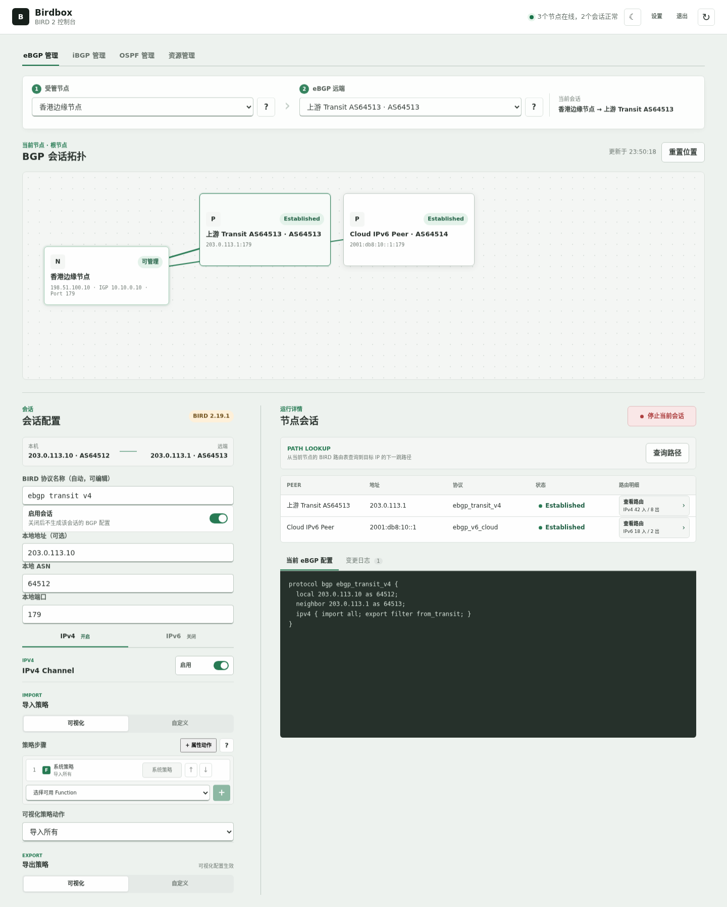
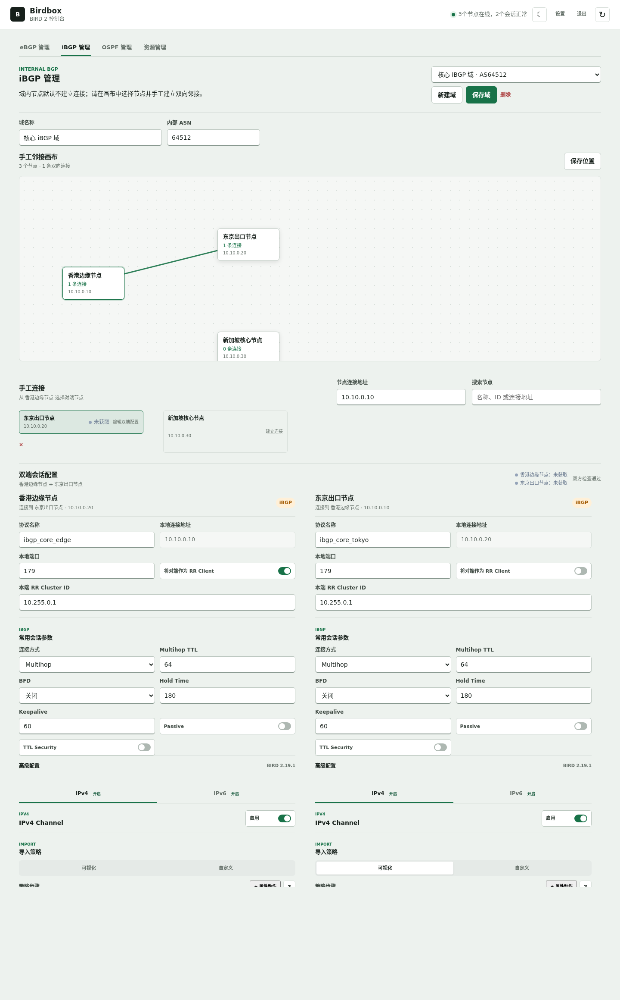
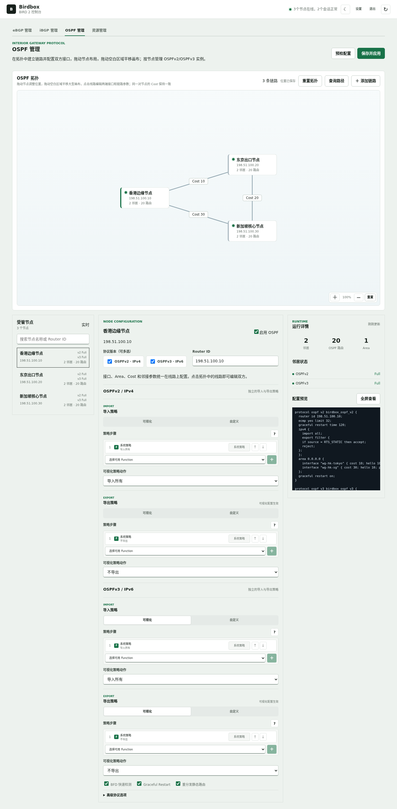
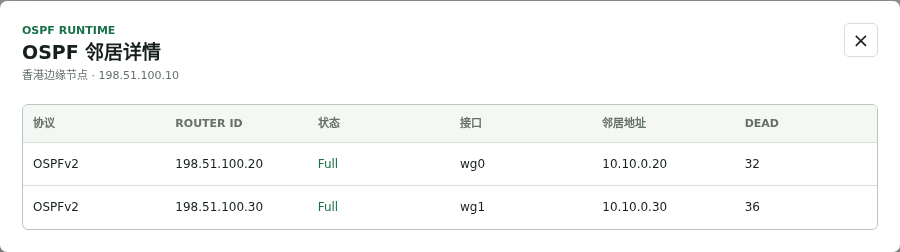
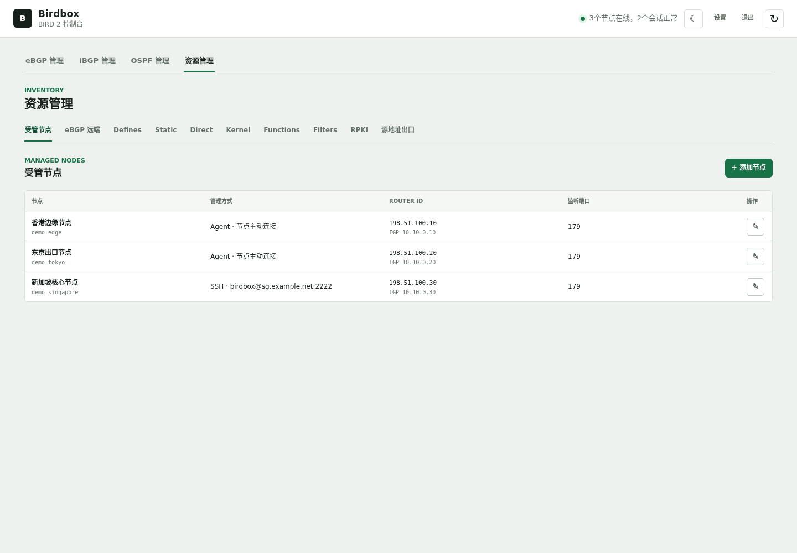
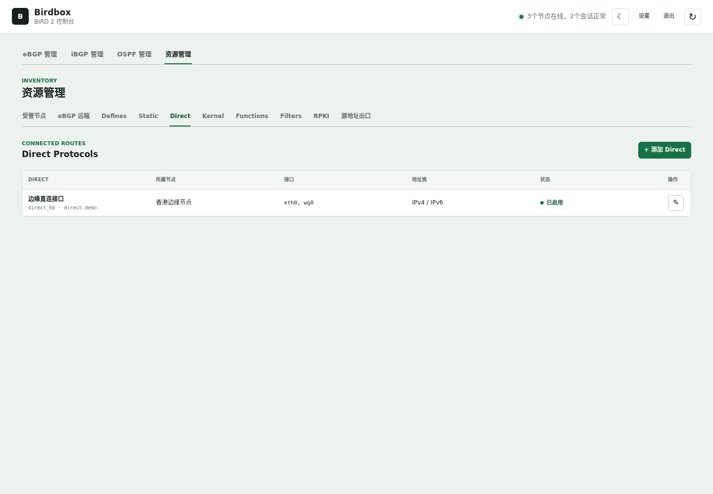

# Birdbox 用户操作手册

本文面向使用 Birdbox 管理 BIRD 2 路由节点的网络管理员。文中的地址、ASN 和节点名称为示例，请替换为实际环境值。所有会改变节点配置的操作都应先执行“预检配置”，确认无误后再“保存并应用”。

## 1. 登录与界面

浏览器打开控制器地址，使用管理员密码登录。首次启动会进入初始化页面；初始化完成后不再显示初始化入口。

主界面分为四个工作区：

- **eBGP 管理**：管理外部 Peer、eBGP 会话、路由策略和运行状态。
- **iBGP 管理**：按域管理内部 BGP，画布用于布局和选择邻接，配置同时编辑连接两端。
- **OSPF 管理**：创建 OSPFv2/OSPFv3 域、编辑链路和查看邻居及路由。
- **资源管理**：集中管理节点、Peer、Define、Static、Direct、Kernel、Function、Filter、RPKI 和源地址出口。

右上角状态灯显示节点和会话总体状态。将鼠标移到状态灯上可查看不可达节点、BIRD 未运行或会话异常的原因。月牙按钮切换浅色、深色和跟随系统主题；主题设置保存在浏览器本地。

点击右上角“设置”可以查看当前有效的登录会话，包括登录时间、最近活动时间、来源地址和浏览器信息。可以单独撤销某个会话，也可以一键撤销其它会话；多会话模式允许多人同时管理，不会因为另一台浏览器登录而把正在编辑的用户踢下线。



## 2. 部署控制器

### 2.1 Docker Compose

准备 Docker Engine 24+、Docker Compose v2 和一个 MySQL 实例。下载仓库后执行：

```bash
git clone https://github.com/pmman289/birdbox.git
cd birdbox
cp .env.example .env
```

编辑 `.env`，至少设置数据库密码和对 Agent 可访问的控制器地址：

```dotenv
BIRDBOX_IMAGE_TAG=latest
MYSQL_DATABASE=birdbox
MYSQL_USER=birdbox
MYSQL_PASSWORD=替换为随机密码
MYSQL_ROOT_PASSWORD=替换为另一组随机密码
BIRDBOX_BIND_ADDRESS=0.0.0.0
BIRDBOX_PORT=3000
BIRDBOX_PUBLIC_URL=https://birdbox.example.com
BIRDBOX_SECURE_COOKIE=true
```

检查并启动：

```bash
docker compose config
docker compose pull
docker compose up -d
docker compose ps
curl -fsS https://birdbox.example.com/api/health
```

`BIRDBOX_IMAGE_TAG=latest` 适合首次安装和验收。生产环境验收完成后建议固定到版本 tag 或镜像 digest，避免后续自动拉取未经验证的镜像。反向代理必须把 `BIRDBOX_PUBLIC_URL` 指向用户和 Agent 实际能够访问的地址；不能填写 `0.0.0.0` 或容器内部地址。

### 2.2 反向代理与 Agent 端口

Agent 采用节点主动回连，不需要开放节点入站端口。Compose 容器内部固定监听 `3000`，宿主机可以映射到其它端口：

```yaml
services:
  birdbox:
    ports:
      - "0.0.0.0:3500:3000"
```

此时 `.env` 应使用 `BIRDBOX_PORT=3500`、`BIRDBOX_PUBLIC_URL=https://birdbox.example.com`，并让反向代理转发到宿主机 `3500`。完整构建、发布和升级说明见 [Docker 发布与部署](docker-release.md) 和 [Agent 主动连接与升级](agent.md)。

### 2.3 备份、升级和回滚

同时备份 MySQL 数据和 Birdbox 数据卷。MySQL 保存库存、认证和部署恢复记录，数据卷保存控制器密钥、Agent 注册信息和 `known_hosts`。升级时执行：

```bash
docker compose pull birdbox
docker compose up -d --no-deps birdbox
docker compose ps
```

不要使用 `docker compose down -v`，除非确认要删除数据库和控制器数据。

## 3. 接入受管节点

### 3.1 新节点使用 Agent 模式

1. 进入“资源管理 → 受管节点 → 添加节点”。
2. 填写节点名称、Router ID、IGP 地址、BIRD 主配置路径、生成配置路径和控制 Socket。
3. 选择目标系统预设。普通 Linux 使用 Linux，OpenWrt/iStoreOS 使用 OpenWrt。
4. 点击“生成准备脚本”。复制完整脚本，在目标节点 root Shell 中执行，或复制页面给出的 `bash <(curl -fsSL URL)` 形式命令直接执行。
5. 脚本会创建专用账户、持久化目录、BIRD Socket 权限、Include 行、Agent 服务和注册密钥，并执行 `bird -p` 检查。脚本可重复执行。
6. 返回 Birdbox 点击“测试连接”。测试成功后保存节点。

Agent 节点由主控通过 RPC 执行配置检查、预检和应用任务；节点无需公网入站 SSH。升级旧节点时，在原节点编辑对话框生成 Agent 升级脚本，确认 Agent 已注册后再切换连接方式。

### 3.2 OpenWrt 注意事项

OpenWrt 使用 `/bin/ash` 和 Dropbear，脚本会自动处理缺少 `runuser`、`su`、`stat` 等常见命令的情况，并把 Home 和生成配置放到 `/etc` 持久存储。默认路径为：

```text
主配置：/etc/bird.conf
生成配置：/etc/birdbox/generated.conf
控制 Socket：/var/run/bird.ctl
```

不要把生成配置或 Agent Home 放到 `/tmp`、`/var` 等重启后会清空的目录。执行完成后应检查：

```sh
logread | grep -i birdbox
birdc show status
```

### 3.3 旧 SSH 节点

旧 SSH 节点仍可修改公网 SSH 地址和端口，IGP 地址保持独立，避免把公网管理地址误用于 BGP 邻居。旧模式只用于兼容和升级，不建议新增。节点删除前，在线节点会先下发空的 Birdbox Include；永久离线节点需使用“强制删除”并按页面提示人工清理 Include 和公钥。

## 4. 创建 eBGP 会话

eBGP 会话由“受管节点 + 外部 Peer + 会话配置”组成。

### 4.1 添加远端 Peer

1. 进入“资源管理 → eBGP 远端 → 添加 Peer”。
2. 选择所属节点，填写 Peer 名称、邻居地址、远端 ASN 和远端端口。
3. IPv6 Link-Local 地址必须带 `%接口`，例如 `fe80::1%eth0`；如果使用直连模式，也可以在会话高级配置中填写接口。
4. 保存 Peer。Peer 只描述远端，不会自动建立会话。

### 4.2 编辑会话

1. 返回“eBGP 管理”，选择受管节点和 Peer。
2. 填写 BIRD 协议名称、本地地址、本地 ASN、本地端口。地址留空时由系统按节点接口自动选择；默认本地端口为 `179`。
3. 在 IPv4/IPv6 页签启用需要的 Channel。IPv4 Channel 通过 IPv6 邻居传输时系统会自动启用 Extended Next Hop；IPv6 Channel 通过 IPv4 邻居时反向处理。
4. 在导入、导出策略中选择全部、无、指定 CIDR Define，或切换到自定义 Filter。策略步骤可以插入已作用于当前节点的 Function。
5. 展开高级配置设置 Multihop、BFD、Graceful Restart、TCP MD5/TCP-AO、Route Refresh、Add-Paths、Next Hop、表名和限制。
6. 点击“预检配置”。页面会置顶显示等待遮罩，返回后在右侧代码框显示当前会话的 BIRD 配置；错误会定位到对应输入框。
7. 点击“保存并应用”。等待节点返回结果，不要在应用过程中刷新或重复点击。成功后运行详情会自动刷新。


### 4.3 查看状态和路由

运行详情只显示当前节点的 eBGP Peer。点击协议状态可查看对应 `birdc show protocols all <protocol>` 信息，点击路由明细可按 IPv4/IPv6 和导入/导出方向查看路由。配置预览只显示当前正在编辑或当前选中的 eBGP 协议，不包含节点其它协议。

## 5. 创建 iBGP 域

### 5.1 创建域和布局

1. 进入“iBGP 管理”，点击“新建域”。
2. 填写域名称和内部 ASN。
3. 画布初始包含所有受管节点。拖动节点调整位置；节点位置只与节点 ID 关联，停止拖动后保存，不会触发页面刷新。需要时点击“保存位置”或重置布局。
4. 点击一个节点，在下方“手工连接”列表中搜索并选择另一个节点。iBGP 不会因为节点同属一个域而自动建立全互联。

### 5.2 同时编辑双方配置

建立连接后，下方会出现左右两列配置，分别代表连接两端。两端的连接地址、协议名、本地端口、BGP 高级配置、IPv4/IPv6 Channel 和导入导出策略都可以独立填写。

- Route Reflector Server 端打开“将对端作为 RR Client”。
- RR Client 端不需要勾选 RR Client；两端可以分别填写本端 RR Cluster ID。
- 在高级配置中设置 Graceful Restart、BFD、Capabilities、Next Hop 和策略步骤。
- 配置变化会触发实时双端预检，预览区域分别显示两端生成的 BIRD 配置。

普通 iBGP 全互联适合节点数量较少的域；RR 架构适合大规模域。一个域可以建立多条邻接，但同一对节点不能复用完全相同的 TCP 五元组；修改本地端口时必须同步规划对端连接端口。



## 6. 创建 OSPF 域

### 6.1 建立域和选择协议版本

1. 进入“OSPF 管理”，创建或选择 OSPF 域。
2. 在节点列表选择节点，勾选 OSPFv2、OSPFv3 或同时勾选两者。OSPFv2 使用 IPv4，OSPFv3 使用 IPv6；两者不是互斥选项。
3. 为每个节点设置 Router ID、是否启用、BFD、Graceful Restart 和是否重分发 Static。

### 6.2 创建链路

1. 点击“添加链路”或点击画布上的节点后选择另一端节点。
2. 在线路编辑区分别选择两端接口。两个节点之间有多条物理或隧道连接时，为每条连接建立独立链路；每条链路可以有不同接口，但同一对节点的 Cost 在域内保持一致。
3. 默认接口类型为 `ptp`，适合项目默认的点到点 GRE/WireGuard 链路。需要广播、NBMA 或 PTMP 时在高级选项修改。
4. 设置 Area、Cost、Hello、Dead、被动模式、认证、BFD、优先级、重传和邻居列表。
5. 点击线路可以直接编辑链路；链路上的 Cost 标签表示该方向的代价。



### 6.3 Area、高级协议和策略

节点配置下方可以编辑 Area 的 Stub、NSSA、Summary、Default Cost、Translator、Networks、External 和 Stubnets。高级协议选项包括 RFC 1583 兼容、RFC 5838、Instance ID、ECMP、ECMP Limit、Stub Router、Tick、外部合并和 Graceful Restart 参数。

OSPF 的导入/导出策略使用和 BGP 相同的 Function、Filter、CIDR Define 可视化编辑器。重分发 Static 生成的 `if source = RTS_STATIC then accept` 位于用户插入步骤之前的倒数第二个固定步骤，避免跳过自定义 Function。

### 6.4 预检、应用和运行详情

点击“预检配置”检查两端完整 BIRD 配置；点击“保存并应用”后等待节点返回。运行详情中的邻居数、OSPF 路由数和 Area 数量都可以点击：

- 邻居数：查看 Router ID、状态、接口、地址和 Dead Time；
- OSPF 路由：查看前缀、下一跳和 Metric；
- Area：查看 Area 参数和接口归属。

“查询路径”可以选择起始节点并输入 IPv4 或 IPv6 目标地址。弹出的路径拓扑会继承普通拓扑位置，经过的节点和下一跳方向用箭头突出，其余节点降低亮度；视口可以缩放、平移，路径窗口中的节点不能移动。



## 7. 资源管理

资源先保存到库存，再按作用域下发到节点。作用域可以选择所有节点或多个指定节点；系统会递归检查 Define、Function、Filter、RPKI、Static 和 Kernel 的引用关系，阻止跨作用域引用、停用资源引用、声明顺序错误和循环依赖。

### Define

Define 是可复用的 BIRD 声明。CIDR Define 分为 IPv4 和 IPv6，只接受标准 CIDR，例如 `2a0a::/32`，不会把 `2400:cb00::/32+{}` 这类 BIRD 扩展语法当作 Static 路由。Define 可以被 Static、会话 Channel、Function、Filter 和 OSPF 策略引用。

CIDR Define 支持手工条目或 IRR AS-SET：填写 AS-SET、IRR Server、数据库、刷新周期、前缀上限和是否允许更具体前缀。控制器使用 `bgpq4` 展开，结果以独立版本文件下发，主配置只 Include 文件，避免主配置过大。展开失败时保留最近一次成功快照。

### Static

Static 是节点级路由资源，一个 Static 只属于一个节点。选择 CIDR Define 后，每个合法 CIDR 都会显示为列表项，可分别选择 `blackhole`、`reject`、`via 地址` 等动作，也可以使用统一快捷操作再逐条修改。每条路由可以填写 per-route filter block，例如设置 BGP Community、Local Preference 或 MED。Import 和 Export 默认分别为 `all`、`none`，但可以独立选择 `all` 或 `none`。

同一 CIDR 被多个 Static 使用时，标准路由动作必须保持一致；不同 Static 可以使用不同 Import/Export。修改被引用的 Define 后，引用它的 Static 路由列表会自动重新计算。

### Direct

Direct 用于从节点接口学习直连路由。一个 Direct 资源只对应一个节点，可以选择 IPv4、IPv6 和接口列表；接口列表为空表示匹配所有接口。没有 Direct，BIRD 不会从接口学习直连路由。

### Kernel

Kernel 用于把 BIRD 路由导出到 Linux FIB。Kernel 可以作用于多个节点或所有节点，分别选择 IPv4/IPv6、Import/Export、路由表、扫描周期和 persist，并可使用 Function/Filter 作为策略。没有 Kernel，BIRD 中的路由不会自动进入系统内核路由表。





### Function

Function 是可复用的路由策略步骤，可以在会话、iBGP、OSPF、Kernel 和 Filter 编辑器中快捷插入。Function 可以只作为源码引用，也可以声明为可调用函数。修改 Function 前应检查引用数量和作用域。

### Filter

Filter 是完整的 BIRD 路由过滤器。可在 eBGP、iBGP、OSPF 和 Kernel 策略编辑器中选择；Filter 内可以调用 Function、Define 和 RPKI `roa_check()`。保存前系统会检查递归引用和作用域。

### RPKI

RPKI 支持本地 ROA 文件和 RPKI-RTR Server，可分别启用 IPv4/IPv6 ROA Table，选择作用于所有节点或多个指定节点。文件模式要求用户先把 ROA 文件同步到目标路径；Server 模式要求目标节点能够访问 RTR 地址和端口。Filter 中通过 `roa_check()` 使用验证结果。

### 源地址出口映射

源地址出口映射把源 CIDR 按出口地址分组，并选择要下发的节点。每个出口组可自定义 Linux Kernel table，默认值只作为建议，避免与现有策略表冲突。Agent 节点会自动维护 `ip rule`、目的地址例外和 BIRD 出口协议；旧 SSH 节点会生成完整的 shell/systemd/OpenWrt 操作清单，供升级 Agent 或人工执行。

出口地址不能落在同组或其它组的源 CIDR 内，否则会造成策略路由递归；保存时会提示拆分源 CIDR 或更换出口地址。Agent 接管旧配置时会保留兼容规则，并补齐出口地址的 main-table 例外。

## 8. 变更安全和故障处理

所有预检、应用和长时间节点操作都会显示置顶等待提示。等待期间不要刷新页面或重复提交。预检失败时，页面会标出具体字段；常见原因包括：

- BIRD 协议名含非法字符或重复；
- IPv4/IPv6 Channel 均未启用；
- IPv6 Link-Local 缺少 `%接口`；
- 自定义策略未选择 Filter；
- Function、Filter 或 Define 作用域不包含目标节点；
- Define、Function、Filter 之间存在递归环；
- 节点上的 BIRD 主配置、Include 路径或 Socket 权限不正确。

应用失败时控制器保留库存并尝试回滚已经完成的节点。先查看事件日志和节点状态，再重新预检。节点离线时不要强制删除仍可能在线的配置；确认节点永久不可达后才使用强制删除。

## 9. 推荐操作规范

1. 先接入节点并确认 Direct、Kernel、BIRD Socket 和 Agent 状态，再创建 BGP/OSPF。
2. 用 Define 管理前缀集合，用 Function 管理可复用动作，用 Filter 组合完整策略；避免把大段重复源码复制到多个会话。
3. 先在单个节点作用域验证资源，再扩展到多个节点或所有节点。
4. OSPF 先建立单链路邻居，再扩展成三角或全网拓扑；每条隧道明确接口、Area、Cost 和认证。
5. iBGP 节点较少时使用全互联，节点较多时使用 RR；RR Server 和 RR Client 的角色按双方配置成对维护。
6. 生产应用前导出库存和数据库备份，记录预检生成的配置，并为关键变更保留事件日志。
7. Agent 使用 HTTPS 回连，限制注册脚本有效期和反向代理访问来源，不在聊天、工单或 Git 中暴露注册密钥。

## 10. 文档截图

仓库中的界面图片位于 `docs/images/`，由 `scripts/generate-doc-screenshots.mjs` 使用 Playwright 采集。脚本通过浏览器请求拦截注入演示库存，只生成截图，不会连接或修改任何真实路由节点：

```bash
node scripts/generate-doc-screenshots.mjs
```

脚本默认访问本机开发实例 `http://127.0.0.1:3000`，也可以通过 `BIRDBOX_SCREENSHOT_URL` 指定其它开发地址。截图前请确认实例使用测试数据和测试凭据，严禁对生产地址运行。
